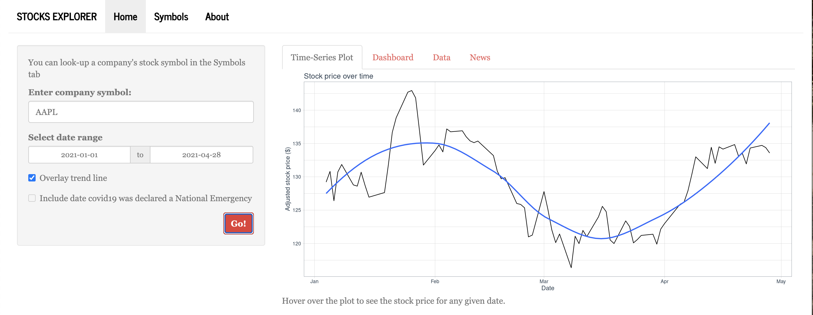

# Stocks Analysis

### Team: JAM
By Allison Li, Jaravee Boonchant, Margaret Reed, Michael Ho

## Introduction 

With the society developing at a rapid rate, our app provides an informative 
stocks analysis that will help navigating your stock choices. The app allows users
to search for their interested company, look up their stock prices, as well as the
up-to-date financial news associated with the selected comoany. 

This GitHub consists of:

1. R scripts containing wrapper functions (`api_wrappers.R`, `get_news.R`, and `calculate_returns.R`)

2. the code for the Shiny located in `runApp.R`. The other codes can be found in `stocks/app/` folder (including `ui.R` and `server.R`).

The users can also [click here](https://mwreed1.shinyapps.io/stocks-app/) to 
open the app online.

## App Usage

The data comes from the `tidyquant` package, where we used functions for 
getting the data and for the theme on our ggplot. We made a 
[shiny app](https://mwreed1.shinyapps.io/stocks-app/). The basic functionality
includes choosing a company and a time range. The first panel 
plots the chosen stock over time, and gives the most recent stock price and 
the minimum and maximum price over the chosen window. Depending on whether 
or not the time window includes it, the check box might be greyed out for 
including the date of the State of Emergency for covid19 in the US. This 
line can contextualize some of the stock price fluctuation. The next tab 
is the data tab, which displays the stock data used for the dashboard. The 
third tab gives financial news about the chosen company. The user can look 
up the stock symbol in the Symbols tab. 

## References

1. [Introduction to tidyquant](https://cran.r-project.org/web/packages/tidyquant/vignettes/TQ00-introduction-to-tidyquant.html)
2. [Learn Shiny](https://shiny.rstudio.com/tutorial/)
3. [Alpha Vantage](https://www.alphavantage.co/) for free Stocks API
4. [Polygon.oi](https://polygon.io/docs/get_v1_meta_symbols__stocksTicker__news_anchor) for financial news API

